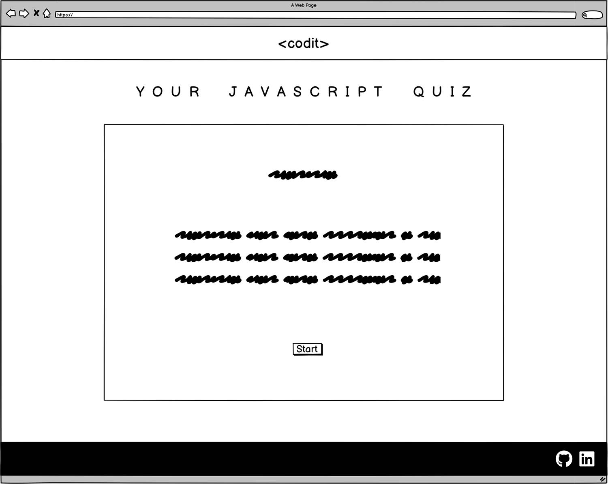
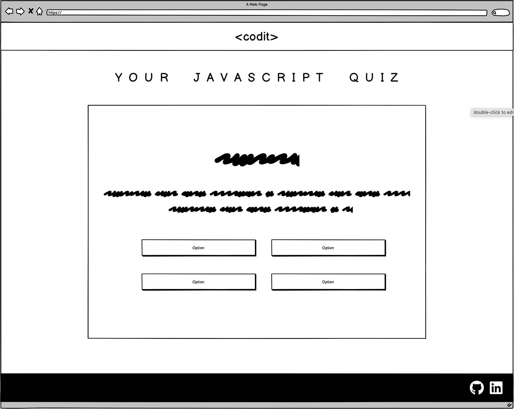
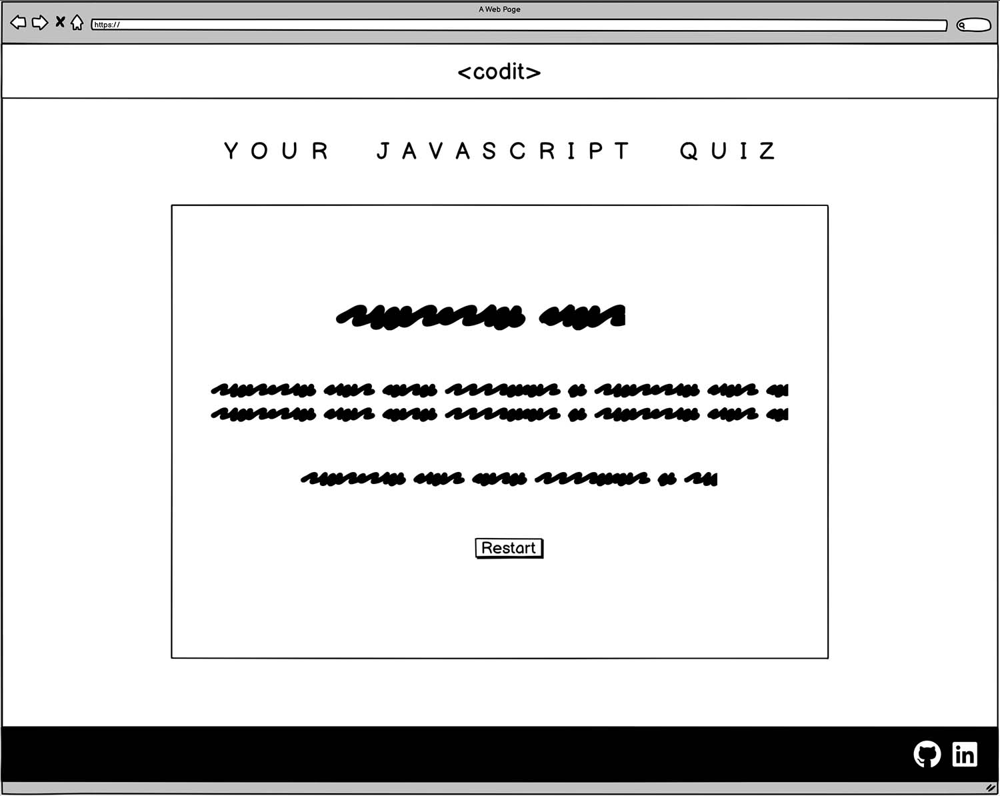
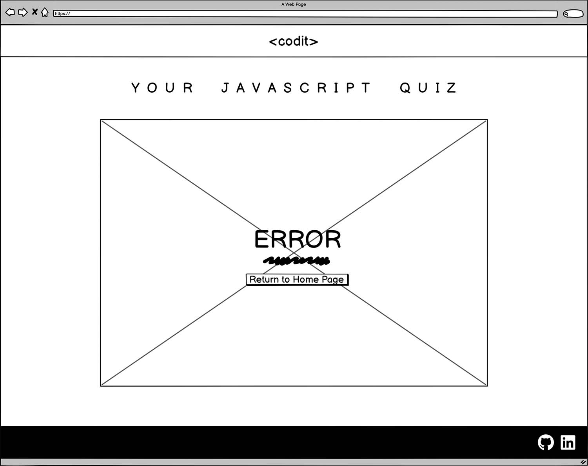

# \<codit\ Quiz>
(Developer: Valentino Braga)

\<codit\> Your JavaScript Quiz is a simple quiz designed for newbies in software development. The game has 10 questions for each new entry and by the end, you can see how many questions you got right. This project's goal is to help new developers not only to test their knowledge but also to learn more about JS in a fun and interactive way.

[Live Website](https://tinobragaa.github.io/codit-quiz/)

# Table Of Contents

* [User Experience](#User-Experience)
  * [User Stories](#User-Stories)

* [Design](#Design)
  * [Colour Scheme](#Colour-Scheme)
  * [Typography](#Typography)
  * [Imagery](#Imagery)
  * [Wireframes](#Wireframes)
  * [Features](#Features)
    
  * [Future Implementations](#Future-Implementations)
  * [Accessibility](#Accessibility)

* [Technologies Used](#Technologies-Used)
  * [Languages Used](#Languages-Used)
  * [Frameworks, Libraries & Programs Used](#Frameworks,-Libraries-&-Programs-Used)

* [Deployment & Local Development](#Deployment-&-Local-Development)
  * [Deployment](#Deployment)
  * [Local Development](#Local-Development)
    * [How to Fork](#How-to-Fork)
    * [How to Clone](#How-to-Clone)

* [Testing](#Testing)
  * [Solved Bugs](#Solved-Bugs)
  * [Known Bugs](#Known-Bugs)
  
* [Credits](#Credits)
  * [Code Used](#Code-Used)
  * [Content](#Content)
  * [Media](#Media)
  * [Acknowledgments](#Acknowledgments)

# User Experience (UX)

## Business Goals

### User Goals
- Find an interactive way to learn
- Clear rules and easy access to it
- Possibility to restart the game
- See if their answer is right or wrong
- Access to their score
- Different questions for new entries

### Website Owner Goals
- Deliver easy-to-read quizzes to test user's knowledge
- Provide a range of questions to increase the dynamic
- To provide a fully responsive quiz that can be played on a range of devices

### Target Audience
- New software developers
- Coding students
- Programming professional's in general

### User Expectations
- Smooth and playable quiz
- Appealing design
- Accessibility

## User Stories

### First-Time User
1. As a first-time user, I want to understand the rules
2. As a first-time user, I want to see if my answer is correct or incorrect
3. As a first-time user, I want to be able to restart the quiz

### Returning User
1. As a returning user, I want to different questions
2. As a returning user, I want to improve my knowledge of JS
3. As a returning user, I want to have fun in a well designed game

### Site Owner
1. As a site owner, I want users to easily understand my project
2. As a site owner, I want users to enjoy and learn at the same time
3. As a site owner, I want ways to have an easy and good experience throughout the quiz

# Design

The website's quiz is designed in four continuous interfaces to enable the user to have a smooth and intuitive experience. The priorities of the \<codit\> are to give an organized and effortless design throughout the quiz, the ability to test the user's expertise and the possibility of continuously learn through random and different questions each time.

The concept behind this project is a minimalist, futuristic and tech kind of vibe. Which is reflected in the logo font that resembles coding-fonts design, in the straightforward colour palette (black, white and JS yellow) and consistent design through the interfaces, buttons and the error page, aiming a positive user experience.

## Wireframes

The initial concept of the design can be seen here and they were made through the Balsamiq wireframing software.

Start Interface Wireframe

 

Rules Interface Wireframe

 

Quiz Interface Wireframe

 

Score Interface Wareframe

 

404 Error Page Wareframe

 

## Typography

Overpass Mono and Press Start 2P fonts were chosen from Google Fonts. Fonts were selected to represent clear, minimalist and "coding" feel they inspire in the user.

## Colour Palette

The colour chosen were: white (#ffffff), JS yellow (#F9DD3C) and github grey-black (#1E1E1E). The colours were tested on Webaim using their contrast checker and the ratio was higher than 12.25:1 meaning that they are a great fit. 

## Structure 

To keep the user interface as easy and smooth as possible I choose 4 game areas continously played and the 404 Error Page. 

- Start Area: The first interface is the start area where the user is greeted and asked about their name.
- Rules Area: The second interface showcase the quiz rules and call the user by their name.
- Quiz Area: The third interface is where the questions and answers are displayed. 
- Score Area: The fourth interface gives users their score and the possibility to restart the quiz.
- Error 404 Page: The Error page is created for broken links with a button to return to the game. 

# Features

# Technologies Used

### Languages
The following languages were used to develop the website:
- HTML
- CSS
- JavaScript

### Frameworks and Tools
The following frameworks and tools were used to develop the website:
- Git
- Github
- Gitpod
- Favicon
- Devtool
- Balsamiq
- Google Fonts
- Font Awesome
- JSHint Validation
- Adobe Photoshop 2023
- Techsini Mockup Generator
- W3C Markup Validation Service

# Testing

### HTML Validation

The Nu HTML Checker (W3C) is used to validate HTML documents. The page passed without any errors.

### CSS Validation

The W3C Jigsaw CSS Validation Service is used to validate CSS documents. The page passed without any errors.

### JS Validation

The JSHint is used to validate JavaScript documents. The page passed without any errors.

### Accessibility

The WAVE web accessibility evaluation tool by WebAIM was used to ensure the webpages met accessibility standards. All 5 pages passed without any errors.

Responsive test on multiple devices
The following devices were used to ensure the site was responsive:

- Ipad Pro
- Galaxy S20
- Macbook Pro
- Iphone 13 Pro
- Iphone 14 Pro Max
- Notebook Acer Predator Helios 300

